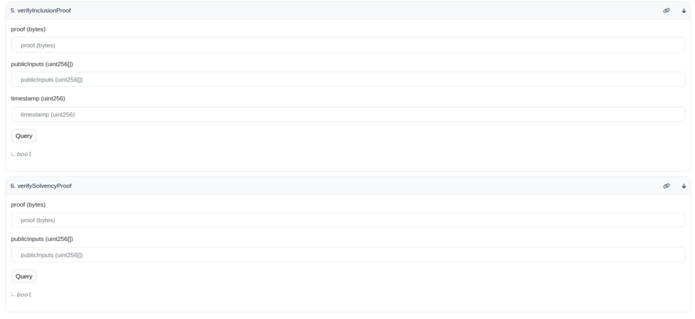

# Backend

This directory contains the backend implementation for the Summa Proof of Solvency protocol.

## Core Components

### Round

The `Round` component represents a specific period or cycle in the Summa Proof of Solvency protocol. It encapsulates the state of the system at a given time, including the snapshot of assets and liabilities, as well as the associated proofs.
The `Round` struct integrates with the `Snapshot` and `SummaSigner` to facilitate the generation and submission of proofs to the contract.

Key Features:

- Initialization of a new round with specific parameters.
- Building a snapshot of the current state.
- Submitting commitment to the contract.
- Retrieving proofs of inclusion for specific users.

### AddressOwnership

The `AddressOwnership` component is responsible for managing and verifying the ownership of addresses. It ensures that addresses used in the protocol owned by the respective participants. This component interacts with the `SummaSigner` to submit proofs of address ownership to on-chain.

Key Features:

- Initialization with specific signer details.
- Dispatching proofs of address ownership to the contract.

## Prerequisites

The `ptau` file, containing the Powers of Tau trusted setup parameters needed to build the zk circuits, is already included. However, if you wish to test or run the code with a higher number of entries, you may choose to download a different `ptau` file.

You can find the necessary files at https://github.com/han0110/halo2-kzg-srs. To download a specific file, you can use:

```
wget https://trusted-setup-halo2kzg.s3.eu-central-1.amazonaws.com/hermez-raw-11
```

After downloading, pass the path to the desired file to the `Snapshot::new` method. If you are using the included `ptau` file, no additional steps are necessary.

## Running Test

To build the binary executable and test it

```
cargo build
cargo test --release -- --nocapture
```

## Important Notices

### Generating and updating verifier contract for Backend

The verifier contract in the backend were generated using a predefined set of parameters: `N_CURRENCIES = 2` and `N_BYTES=8`, as indicated [here](https://github.com/summa-dev/summa-solvency/blob/master/zk_prover/examples/gen_inclusion_verifier.rs#L21-L22).
If you intend to work with different parameters, you'll need to adjust these hard-coded values and then generate new verifier contract.

The process described below assists in both generating the verifier and updating the Summa contract, which integrates the new verifier as constructors.

#### Using the Bash Script

We have provided a bash script to automate the process of updating the verifier contract and the Summa contract. To use the script:

Ensure you have the necessary permissions to execute the script.

```
backend $ scripts/update_verifier_contract.sh
```

## Summa solvency flow example

This example illustrates how Summa interacts with the Summa contract and the user side.

To execute this example, use the command:

```
cargo run --release --example summa_solvency_flow
```

### 1. Submitting Address Ownership to the Summa Contract

First, we submit proof of address ownership to the Summa contract. This is a critical step to register these proofs on-chain, facilitating the validation of asset ownership within Summa.

Key points:

- An instance of `AddressOwnership`, named `address_ownership_client`, is initialized with the `signatures.csv` file, which contains the signature data.

- The `dispatch_proof_of_address_ownership` function sends a transaction to the Summa contract to register CEX-owned addresses.

Note: This demonstration takes place in a test environment. In real-world production, always ensure that the Summa contract is correctly deployed on the target chain.

If executed successfully, you'll see:

```
1. Ownership proofs are submitted successfully!
```

### 2. Submit Commitment

The CEX must submit a commitment to the Summa contract for each round. This commitment consists of a `timestamp`, the root hash of the Merkle Sum Tree (`mst_root`), and `balances`.

Without publishing the commitment, users cannot verify their inclusion proof on the Summa contract. This is because the inclusion verifier function internally requires the `mst_root`, but users only know the `timestamp` associated with the round and the verifier functions does not requre `mst_root` directly.

In here, we'll introduce you through the process of submitting a commitment using the `Round` to the Summa contract.
The Round serves as the core of the backend in Summa, and we have briefly described it in the Components section.

To initialize the `Round` instance, you'll need paths to the liabilities CSV file (`entry_16.csv`) and the `ptau/hermez-raw-11` file. The files serve the following purpose:

- `entry_16.csv`: contains the username and liabilities entries for each CEX user (necessary to build the commitment). Liabilities column names have the following format: `balance_<CRYPTOCURRENCY>_<CHAIN>`, where <CRYPTOCURRENCY> and <CHAIN> are the names of the cryptocurrencies and their corresponding blockchains. <CHAIN> values are the same as in the Address Ownership Proof step;
- `ptau/hermez-raw-11`: contains parameters for constructing the zk circuits.

Using the `Round` instance, the solvency proof is dispatched to the Summa contract with the `dispatch_solvency_proof` method.

If this step successfully ran, you can see this message:

```
2. Solvency proof is submitted successfully!
```

### 3. Generating and Exporting Inclusion Proofs

Assuming you're a CEX, after committing the `solvency` and `ownership` proofs to the Summa contract, you should generate inclusion proofs for every user. This proof verifies the presence of specific elements in the Merkle sum tree, which is part of the solvency proof.

After generating the inclusion proof, it's transformed into a JSON format for easy sharing.

Upon successful execution, you'll find a file named `user_0_proof.json` and see the following message:

```
3. Exported proof to user #0, as `user_0_proof.json`
```

### 4. Verify Proof of Inclusion

This is the final step in the Summa process and the only part that occurs on the user side.

Users receive the proof for a specific round and use methods available on the deployed Summa contract. Importantly, the Summa contract verifier function is a view function, meaning it doesn't consume gas or change the blockchain's state.

In this step, the user has to:

- Ensure the `leaf_hash` (public input of the proof) aligns with the Poseidon hash of the `username` and `balances` provided by the CEX.
- Submit the proof to the `verify_inclusion_proof` method on the Summa contract Which will:
  - Retrieve the `mstRoot` from the Summa contract and match it with the `root_hash` in the proof.
  - Retrieve the `rootBalances` from the Summa contract and match it with the `root_balances` in the proof
  - Verify the zk Proof

The result will display as:

```
4. Verifying the proof on contract verifier for User #0: true
```

**Note:** In a production environment, users can independently verify their proof using public interfaces, such as Etherscan, as shown below:

This offers an added layer of transparency and trust.
